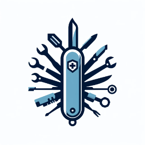

# Security Army Knife

This repository contains security utilities. The features will be announced soon.



## Run

```
make run -- \
    -cve examples/cve-advisories.txt \
    -dep examples/dependencies.csv \
    -arc examples/architecture.drawio.html
```

## Developing

Install dependencies:

```
make setup
```

Execute tests:

```
make test
```

Format code:

```
make format
```

Requirements:

- easy to run and launch without errors
- chore: format code, comment purpose
